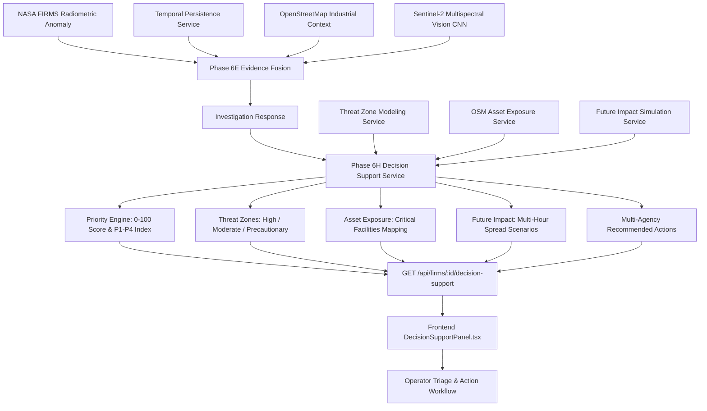

# Phase 6H — Operational Decision Support & Incident Prioritization Report

**Project:** Smart India Hackathon 2026 (Problem Statement ID 26162)  
**System:** AI-Based Detection and Classification of Industrial Fires and Persistent Thermal Sources  
**Phase:** Phase 6H — Operational Decision Support & Incident Prioritization  
**Timestamp:** 2026-09-08T11:57:00Z  
**Status:** COMPLETED & VERIFIED  

---

## 1. Executive Summary

Phase 6H completes the **"DECIDE"** layer of the SIH 2026 operational incident lifecycle:

$$\text{DETECT} \longrightarrow \text{INVESTIGATE} \longrightarrow \text{DECIDE}$$

Operators can now transition from multi-source thermal and optical investigation into concrete, prioritized operational decision-making directly within the incident workspace. Phase 6H integrates:

1. **Deterministic Incident Prioritization Engine ($0-100$ Score, Levels `CRITICAL`, `HIGH`, `MEDIUM`, `LOW`, Index `P1`–`P4`):** Transparent, multi-factor prioritization synthesizing operational risk ($45\%$), critical infrastructure proximity ($30\%$), candidate classification bonus ($15\%$), and multi-pass temporal persistence bonus ($10\%$).
2. **Dynamic Threat Zone & Evacuation Modeling:** Multi-tier hazard envelope modeling (High Hazard Zone, Moderate Hazard Zone, Precautionary Buffer Zone) with specific protective actions.
3. **Critical Infrastructure & Asset Exposure Mapping:** Direct geospatial aggregation of high-vulnerability facilities (LNG storage, petrochemical refining, power substations, hospitals, explosive depots).
4. **Future Impact Multi-Scenario Projections:** Multi-window ($+1\text{h}$, $+3\text{h}$, $+6\text{h}$) spread forecasting and downwind plume advisory notes.
5. **Multi-Agency Action Matrix:** Prescriptive response tasks tailored for Industrial Fire Brigades, District Disaster Authorities, Pollution Control Boards, and Local Police.
6. **Strict Operational & Regulatory Disclaimers:** All 3 mandatory warnings strictly preserved across backend responses and frontend UI widgets.

---

## 2. Decision Support Architecture & Data Flow

---

## 3. Prioritization Scoring Formula & Explainability

The prioritization engine uses a deterministic, transparent composite formula:

$$\text{Priority Score} = \min\left(100.0, \; S_{\text{risk}} + S_{\text{asset}} + S_{\text{class}} + S_{\text{persistence}}\right)$$

Where:
- $S_{\text{risk}} = \text{Risk Score} \times 0.45$ (Maximum 45 points)
- $S_{\text{asset}} = \min(30.0, \; N_{\text{crit}} \times 12.5 + N_{\text{high}} \times 6.0 + N_{\text{mod}} \times 2.5)$ (Maximum 30 points)
- $S_{\text{class}} = 15.0$ if Candidate is `INDUSTRIAL_FIRE`, $8.0$ if `WILDFIRE`, $0.0$ if `NON_FIRE` (Maximum 15 points)
- $S_{\text{persistence}} = \min(10.0, \; \text{Persistence Score} \times 0.10)$ (Maximum 10 points)

### Priority Tiers & Index Mapping:

| Score Range | Priority Level | Priority Index | Operational SLA / Dispatch Profile |
| :--- | :--- | :--- | :--- |
| **80 – 100** | `CRITICAL` | **P1** | Immediate emergency dispatch; specialized foam tender & exclusion perimeter. |
| **60 – 79.9** | `HIGH` | **P2** | Rapid response deployment; water tender & asset cooling protocol. |
| **35 – 59.9** | `MEDIUM` | **P3** | Priority investigation; ground surveillance & aerial drone verification. |
| **0 – 34.9** | `LOW` | **P4** | Standard monitoring; log incident & schedule next-pass satellite pass. |

---

## 4. Verification & Test Suite Summary

### 4.1 Backend Automated Tests (`tests/test_phase6h_decision_support.py`)
- **Total Tests:** 17
- **Passed:** 17 ($100\%$)
- **Execution Time:** ~3.06s
- **Coverage Areas:**
  - Valid decision support generation (`test_01`)
  - 404 & 400 input validation (`test_02`, `test_03`)
  - Priority scoring & explainability (`test_04`)
  - Threat zones radii & structure (`test_05`)
  - Threat zone fault isolation (`test_06`)
  - Asset exposure classification (`test_07`)
  - Asset exposure fault isolation (`test_08`)
  - Impact assessment calculation (`test_09`)
  - Future impact timeline projections (`test_10`)
  - Future impact timeout isolation (`test_11`)
  - Recommended action generation (`test_12`)
  - Summary synthesis (`test_13`)
  - Provenance & timestamps (`test_14`)
  - Safety flags & disclaimers (`test_15`)
  - In-memory caching (`test_16`)
  - Alias route parity (`test_17`)

### 4.2 Full Backend Phase 6 Regression
- **Total Tests:** 79 (Phases 6A–6H)
- **Passed:** 79 ($100\%$)
- **Status:** Complete Regression Clean

### 4.3 Frontend Automated Tests (`frontend/tests/test_phase6h_decision_support.test.mjs`)
- **Total Tests:** 28 (16 Phase 6G + 12 Phase 6H)
- **Passed:** 28 ($100\%$)
- **TypeScript Build:** `tsc && vite build` passed with zero errors (`dist/` generated).

---

## 5. Mandatory Disclaimers Preserved

All 3 mandatory disclaimers are returned in the response payload and displayed in the frontend:

1. *"AI Candidate Classification is an evidence-fusion output, not a standalone confirmation of an industrial fire."*
2. *"Sentinel-2 imagery is optical evidence and may not be temporally coincident with the FIRMS observation."*
3. *"Dynamic threat zones and scenario projections are simulation estimates — NOT official government evacuation orders."*

---

## 6. Conclusion

Phase 6H successfully bridges scientific AI evidence and practical frontline operations. The SIH 2026 system now possesses a fully verified end-to-end pipeline from satellite ingestion to automated multi-agency decision support.
