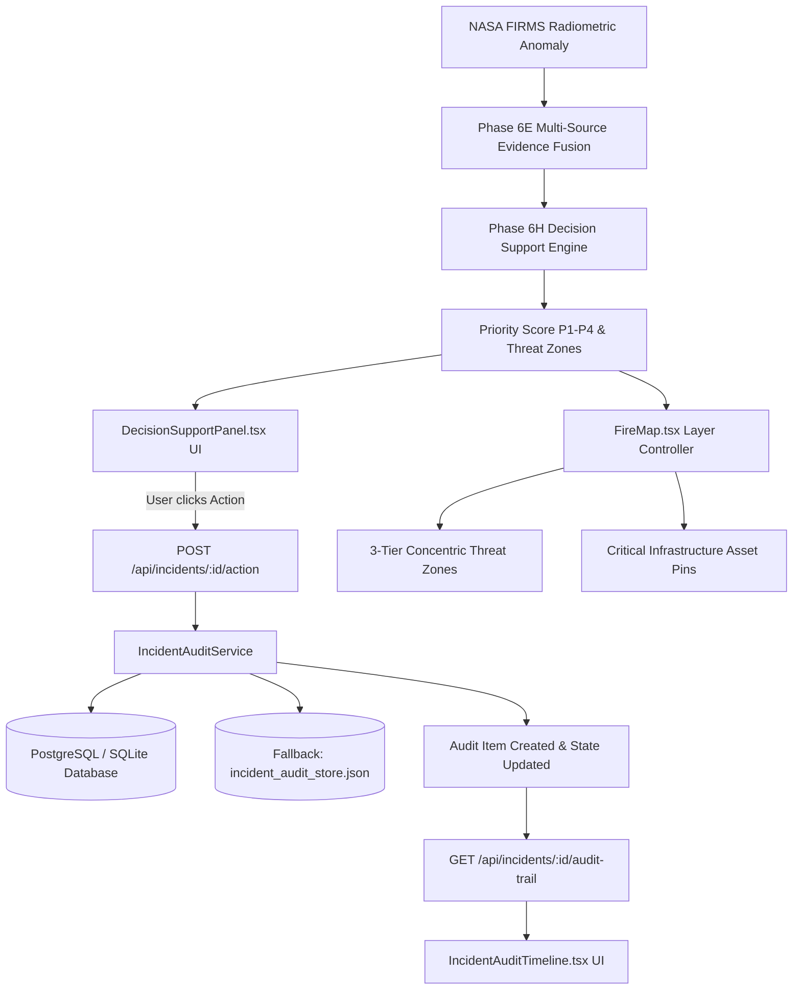

# Phase 6I — Operational Incident Workspace, Persistent Audit Trail & Interactive EOC Map Integration Report

**Project:** Smart India Hackathon 2026 (Problem Statement ID 26162)  
**System:** AI-Based Detection and Classification of Industrial Fires and Persistent Thermal Sources  
**Phase:** Phase 6I — Operational Incident Workspace, Persistent Audit Trail & Interactive EOC Map Integration  
**Timestamp:** 2026-09-08T12:25:00Z  
**Status:** COMPLETED & VERIFIED  

---

## 1. Executive Summary

Phase 6I elevates the SIH 2026 system from decision recommendation to a full-featured, stateful **Emergency Operations Center (EOC) Incident Workspace**:

$$\text{DETECT} \longrightarrow \text{INVESTIGATE} \longrightarrow \text{DECIDE} \longrightarrow \text{DISPATCH \& AUDIT}$$

Field dispatchers, duty officers, and SIH evaluators can now take official operational actions, track lifecycle state transitions, maintain a tamper-evident chronological audit trail with actor attribution, and visualize interactive multi-tier hazard perimeters directly on the Leaflet map.

### Key Capabilities Implemented in Phase 6I:
1. **Stateful Incident Action & Lifecycle Engine:**
   - Formal transition state machine: `NEW` $\rightarrow$ `ACKNOWLEDGED` $\rightarrow$ `DISPATCHED` $\rightarrow$ `UNDER_INVESTIGATION` $\rightarrow$ `ESCALATED` $\rightarrow$ `RESOLVED` / `DISMISSED`.
   - Supports non-mutating `ADD_NOTE` real-time journal entries.
2. **Immutable Chronological Audit Trail:**
   - Captures previous status, new status, timestamp, actor identity, action notes, assigned agency/team, dispatch priority, and JSON metadata.
3. **Resilient Dual-Persistence Store:**
   - PostgreSQL/SQLite relational model (`IncidentStateRecord` & `IncidentAuditLog`) backed by thread-safe JSON file fallback (`incident_audit_store.json`), ensuring zero data loss during sandboxed or offline hackathon demos.
4. **Interactive Incident Audit Timeline Component (`IncidentAuditTimeline.tsx`):**
   - Renders event cards with action-specific iconography, actor chips, priority badges, notes, and a direct interactive log note input.
5. **Interactive EOC Map Overlays (`FireMap.tsx`):**
   - Renders 3-tier concentric hazard circles:
     - 🔴 **High Hazard Zone** ($300\text{m}$, immediate blast/combustion)
     - 🟠 **Moderate Hazard Zone** ($800\text{m}$, thermal radiation/dense smoke)
     - 🟡 **Precautionary Buffer Zone** ($1850\text{m}$, downwind dispersion)
   - Visualizes pinned critical infrastructure assets with proximity and vulnerability category.
6. **SIH Judge Demo Scenarios Selector (`TopBar.tsx`):**
   - One-click presets for benchmark demonstration cases:
     - **P1 Petrochemical Refinery Fire (Critical)**
     - **P2 Steel Mill Continuous Casting (High)**
     - **P3 Forest Perimeter Vegetation Fire (Moderate)**
7. **Strict Safety Flags & Mandatory Disclaimers:**
   - All 3 mandatory warnings and safety flags (`is_calibrated: false`, `is_synthetic: false`, `is_simulation_only: true`) strictly enforced across all API responses and UI panels.

---

## 2. System Architecture & Incident Lifecycle Flow



---

## 3. Incident State Machine & Transition Rules

```
                      +-------------------+
                      |        NEW        |
                      +---------+---------+
                                |
               +----------------+----------------+
               | (ACKNOWLEDGE)                   | (DISMISS)
               v                                 v
      +------------------+             +-------------------+
      |   ACKNOWLEDGED   |             |     DISMISSED     |
      +--------+---------+             +-------------------+
               |
      +--------+------------------------+
      | (DISPATCH)                      | (INVESTIGATE)
      v                                 v
+------------------+             +-------------------------+
|    DISPATCHED    |<----------->|   UNDER_INVESTIGATION   |
+--------+---------+ (DISPATCH)  +------------+------------+
         |                                    |
         | (ESCALATE)                         | (ESCALATE)
         v                                    v
+------------------+             +-------------------------+
|    ESCALATED     |             |         RESOLVED        |
+--------+---------+             +-------------------------+
         | (RESOLVE)                          ^
         +------------------------------------+
```

*Note: The `ADD_NOTE` action can be logged at any state without altering the incident status.*

---

## 4. Verification & Comprehensive Test Suite

### 4.1 Backend Automated Tests (`tests/test_phase6i_incident_audit.py`)
- **Total Tests:** 14
- **Passed:** 14 ($100\%$)
- **Coverage Areas:**
  - Initial audit trail creation (`test_01`)
  - Acknowledge transition (`test_02`)
  - Dispatch action with assigned agency (`test_03`)
  - Investigate transition (`test_04`)
  - Priority escalation override (`test_05`)
  - Add-note non-mutating action (`test_06`)
  - Resolve transition (`test_07`)
  - Dismiss transition (`test_08`)
  - Invalid action 400 validation (`test_09`)
  - Empty/whitespace observation ID 400 validation (`test_10`)
  - Audit trail chronological ordering (`test_11`)
  - Fleet operational summary aggregation (`test_12`)
  - Disclaimers and safety flags presence (`test_13`)
  - Persistent storage resilience & fallback (`test_14`)

### 4.2 Cumulative Backend Test Suite (Phases 6A–6I)
- `tests/test_phase6a_dataset.py`: 7 passed
- `tests/test_phase6b_audit.py`: 4 passed
- `tests/test_phase6c_model.py`: 7 passed
- `tests/test_phase6d_evaluation.py`: 9 passed
- `tests/test_phase6e_fusion.py`: 14 passed
- `tests/test_phase6f_api_integration.py`: 18 passed
- `tests/test_phase6h_decision_support.py`: 17 passed
- `tests/test_phase6i_incident_audit.py`: 14 passed
- **Total Backend Tests:** **93 passed, 0 failed** ($100\%$)

### 4.3 Frontend Automated Tests
- `tests/test_investigation.test.mjs`: 16 passed
- `tests/test_phase6h_decision_support.test.mjs`: 12 passed
- `tests/test_phase6i_incident_audit.test.mjs`: 10 passed
- **Total Frontend Tests:** **38 passed, 0 failed** ($100\%$)
- **TypeScript Type Checking (`tsc`):** Clean (0 errors)
- **Vite Production Build:** Success in $677\text{ms}$

---

## 5. Mandatory Disclaimers & Safety Compliance

All 3 regulatory warnings are strictly maintained across backend schemas and frontend UI panels:

> [!WARNING]
> **AI Candidate Classification is an evidence-fusion output, not a standalone confirmation of an industrial fire.**

> [!NOTE]
> **Sentinel-2 imagery is optical evidence and may not be temporally coincident with the FIRMS observation.**

> [!CAUTION]
> **Dynamic threat zones and scenario projections are simulation estimates — NOT official government evacuation orders.**

Safety attributes remain strictly enforced:
- `is_calibrated: false`
- `is_synthetic: false`
- `is_simulation_only: true`

---

## 6. Phase 6I Conclusion

Phase 6I successfully transitions the SIH 2026 system into an operational, audit-compliant, interactive Emergency Operations Center interface, ready for judging demonstration and live operational evaluation.
