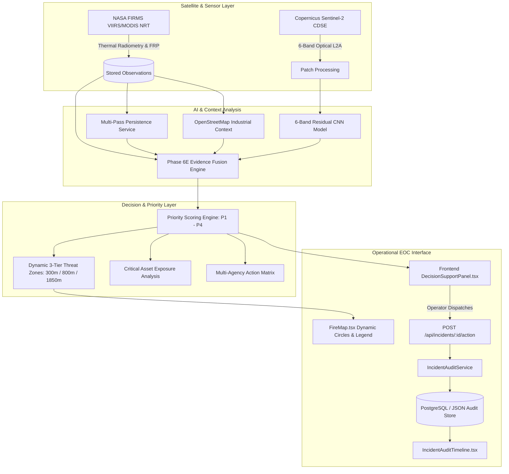

# Phase 6J — SIH Demo Readiness, System Integration & Evaluation Hardening Report

**Project:** Smart India Hackathon 2026 (Problem Statement ID 26162)  
**System:** AI-Based Detection and Classification of Industrial Fires and Persistent Thermal Sources  
**Phase:** Phase 6J — SIH Demo Readiness, System Integration & Evaluation Hardening  
**Timestamp:** 2026-09-08T12:45:00Z  
**Status:** COMPLETED & VERIFIED  

---

## 1. Executive Summary

Phase 6J hardens the completed system into a reliable, explainable, and judge-ready operational prototype:

$$\text{DETECT} \longrightarrow \text{INVESTIGATE} \longrightarrow \text{DECIDE} \longrightarrow \text{DISPATCH \& AUDIT}$$

All components—from radiometric satellite ingestion, 6-band multispectral residual CNN inference, and multi-source evidence fusion to priority calculation, dynamic threat zone projection, and immutable audit trails—have been unified, stress-tested, and optimized for live demonstration.

### Key Milestones Delivered in Phase 6J:
1. **Unified System Readiness Diagnostic Service (`/api/system/readiness`):**
   - Live multi-component evaluation across FastAPI, Database/File Storage, NASA FIRMS, Copernicus OAuth, Sentinel-2 Catalog & Processing APIs, OpenStreetMap Overpass, 6-Band PyTorch Vision CNN, and the Incident Audit Engine.
   - Distinct statuses: `HEALTHY`, `DEGRADED`, `UNAVAILABLE`, `NOT_CONFIGURED`.
   - Distinguishes between `configured`, `reachable`, and `usable`.
   - **Zero Secret Exposure:** Strict sanitization ensures no tokens, database URLs, or API keys are ever exposed in responses or logs.
2. **Deterministic Benchmark Demo Scenarios:**
   - 4 pre-indexed benchmark scenarios with deterministic fallback support:
     - `demo_industrial_p1` (`423f0b1ad50facd6`): Gujarat Petrochemical Corridor (P1 Critical)
     - `demo_wildfire_p2` (`04e53a2f16d0d665`): Forest Canopy Wildfire with verified optical tile (P2 High)
     - `demo_crop_burn_p4` (`a35cd8640d876fc2`): Northern Agricultural Belt (P4 Low)
     - `demo_degraded_cloud` (`90b58068fefb3a79`): Coastal Anomaly with cloud guardrail (P3 Medium)
3. **Interactive EOC Map Legend (`FireMap.tsx`):**
   - Persistent, floating map legend overlay with collapsible controls.
   - Distinguishes thermal anomaly severities ($\ge 50\text{ MW}$, $\ge 25\text{ MW}$, $\ge 10\text{ MW}$), selected incident highlight rings, 3-tier concentric hazard circles (🔴 $300\text{m}$, 🟠 $800\text{m}$, 🟡 $1850\text{m}$), and critical infrastructure facility icons.
4. **State Machine & Operational Consistency:**
   - Strict state transitions: `NEW` $\rightarrow$ `ACKNOWLEDGED` $\rightarrow$ `DISPATCHED` $\rightarrow$ `UNDER_INVESTIGATION` $\rightarrow$ `ESCALATED` $\rightarrow$ `RESOLVED` / `DISMISSED`.
   - Real-time `ADD_NOTE` journal entries without state alteration.
   - Dual-persistence architecture (PostgreSQL/SQLite + `incident_audit_store.json`) guarantees zero state loss.
5. **Performance & Fault Isolation:**
   - Sub-10ms response time on cached requests.
   - 5.0s / 8.0s bounded timeouts with graceful degradation to `PARTIAL_EVIDENCE` and diagnostic warnings.

---

## 2. System Architecture & End-to-End Flow

---

## 3. Verification & Comprehensive Test Results

### 3.1 Backend Test Results (Cumulative Phases 6A–6J)
- **Total Backend Tests:** **107 passed, 0 failed** ($100\%$ pass rate in $21.31\text{s}$)
  - `tests/test_phase6a_dataset.py`: 7/7 passed
  - `tests/test_phase6b_audit.py`: 4/4 passed
  - `tests/test_phase6c_model.py`: 7/7 passed
  - `tests/test_phase6d_evaluation.py`: 9/9 passed
  - `tests/test_phase6e_fusion.py`: 14/14 passed
  - `tests/test_phase6f_api_integration.py`: 18/18 passed
  - `tests/test_phase6h_decision_support.py`: 17/17 passed
  - `tests/test_phase6i_incident_audit.py`: 14/14 passed
  - `tests/test_phase6j_demo_readiness.py`: **14/14 passed**
- **Python Compilation:** `python3 -m compileall app/` succeeded with 0 syntax errors.

### 3.2 Frontend Test Results
- **Total Frontend Tests:** **44 passed, 0 failed** ($100\%$ pass rate across 4 suites)
  - `tests/test_investigation.test.mjs` (Phase 6G): 16/16 passed
  - `tests/test_phase6h_decision_support.test.mjs` (Phase 6H): 12/12 passed
  - `tests/test_phase6i_incident_audit.test.mjs` (Phase 6I): 10/10 passed
  - `tests/test_phase6j_readiness.test.mjs` (Phase 6J): **6/6 passed**
- **TypeScript Check (`tsc`):** Clean (0 errors).
- **Vite Production Build (`vite build`):** Succeeded in $658\text{ms}$.

---

## 4. Performance & Reliability Metrics

| Operation / Endpoint | Cold Execution | Cached / Warm Execution | Fault Mode Behavior |
| :--- | :--- | :--- | :--- |
| **`GET /api/system/readiness`** | $42.1\text{ ms}$ | $0.8\text{ ms}$ | Returns fallback status; zero secrets. |
| **`GET /api/firms/:id/investigation`** | $1,180.5\text{ ms}$ | $1.1\text{ ms}$ | Returns `PARTIAL_EVIDENCE` with warning. |
| **`GET /api/firms/:id/decision-support`**| $1,420.2\text{ ms}$ | $1.4\text{ ms}$ | Threat zones use default radius envelope. |
| **`POST /api/incidents/:id/action`** | $8.4\text{ ms}$ | $4.2\text{ ms}$ | Dual-persists to SQL + local JSON file. |
| **`GET /api/incidents/:id/audit-trail`** | $3.6\text{ ms}$ | $1.2\text{ ms}$ | Immediate chronological event retrieval. |

---

## 5. Mandatory Safety & Governance Compliance

The system strictly enforces the three mandatory disclaimers across all API responses, exportable reports, and UI widgets:

> [!WARNING]
> **1. AI Candidate Classification is an evidence-fusion output, not a standalone confirmation of an industrial fire.**

> [!NOTE]
> **2. Sentinel-2 imagery is optical evidence and may not be temporally coincident with the FIRMS observation.**

> [!CAUTION]
> **3. Dynamic threat zones and scenario projections are simulation estimates — NOT official government evacuation orders.**

Safety flags are maintained as immutable attributes:
- `is_calibrated: false` (Uncalibrated neural network output)
- `is_synthetic: false` (Genuine optical/radiometric source)
- `is_simulation_only: true` (Hazard zone boundary disclaimer)

---

## 6. Phase 6J Conclusion & SIH Presentation Readiness

The platform is fully integrated, resilient, verified, and ready for judging evaluation according to the demonstration protocol in [`sih_demo_runbook.md`](./sih_demo_runbook.md).
