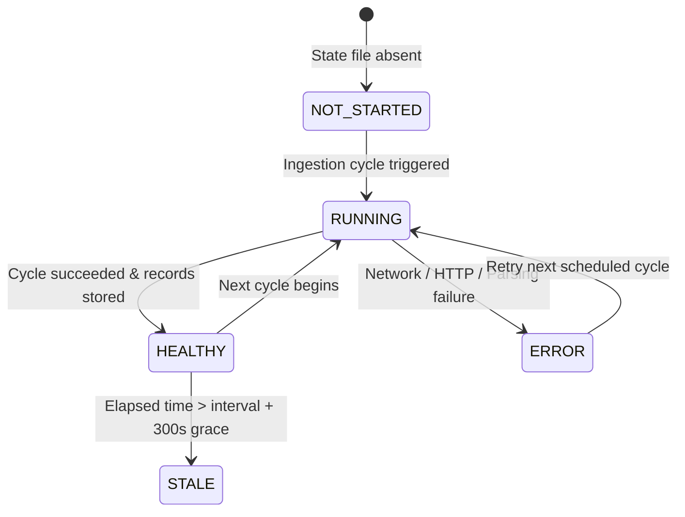

# Phase 2: Automatic NASA FIRMS Ingestion Pipeline

**Project:** SIH 26162 — Industrial Fire & Persistent Thermal Source Intelligence Platform  
**Phase:** Phase 2 — Automated Near-Real-Time (NRT) NASA FIRMS Ingestion  
**Status:** Completed & Verified  

---

## 1. Executive Summary

Phase 2 establishes an automated, resilient, and deterministic Near-Real-Time (NRT) ingestion pipeline for NASA FIRMS (Fire Information for Resource Management System) active fire hotspot data across India. 

The pipeline runs as an isolated background worker or on-demand service, periodically fetching satellite observations from NASA FIRMS, normalizing raw sensor data into a standardized observation schema, deduplicating records using spatial-temporal cryptographic hashing, and safely persisting data to atomic local JSON storage without introducing heavy relational or NoSQL database dependencies.

---

## 2. Ingestion Architecture

```
                                  +-----------------------------+
                                  |   NASA FIRMS API / Feeds    |
                                  | (VIIRS SNPP / NOAA-20 / MOD)|
                                  +--------------+--------------+
                                                 |
                                     HTTPS (Timeout Protected)
                                                 |
                                                 v
                                  +-----------------------------+
                                  |    Ingestion Service /      |
                                  |     Background Worker       |
                                  | (app/workers/firms_ingest)  |
                                  +--------------+--------------+
                                                 |
                                     1. Normalize Schema
                                     2. Deterministic SHA-256 Hash
                                     3. In-Memory ID Deduplication
                                                 |
                                                 v
                        +------------------------+------------------------+
                        |                                                 |
                        v                                                 v
         +------------------------------+                 +------------------------------+
         | data/processed/              |                 | data/processed/              |
         | firms_observations.json      |                 | firms_ingestion_state.json   |
         | (Atomic os.replace Storage)  |                 | (Atomic Ingestion State)     |
         +--------------+---------------+                 +--------------+---------------+
                        |                                                 |
                        +------------------------+------------------------+
                                                 |
                                                 v
                                  +-----------------------------+
                                  |       FastAPI Backend       |
                                  |  GET /api/firms/status      |
                                  |  GET /api/firms/observations|
                                  +-----------------------------+
```

---

## 3. Standardized Observation Schema

Each incoming thermal observation is parsed and standardized into the following strict schema:

```json
{
  "observation_id": "423f0b1ad50facd6",
  "latitude": 24.23818,
  "longitude": 97.22869,
  "brightness": 336.77,
  "confidence": "nominal",
  "frp": 5.28,
  "acquired_at": "2026-09-07 05:59 UTC",
  "satellite": "Suomi-NPP (VIIRS)",
  "instrument": "VIIRS",
  "source": "NASA FIRMS",
  "ingested_at": "2026-09-07T15:34:19.215261+00:00"
}
```

### Schema Field Specification:

| Field | Type | Description |
|---|---|---|
| `observation_id` | `string` | 16-character deterministic SHA-256 hash composite key. |
| `latitude` | `float` | Hotspot latitude in decimal degrees (rounded to 5 decimal places). |
| `longitude` | `float` | Hotspot longitude in decimal degrees (rounded to 5 decimal places). |
| `brightness` | `float` | Channel brightness temperature in Kelvin. |
| `confidence` | `string` / `int` | Detection confidence level (`low`, `nominal`, `high` or numeric 0–100). |
| `frp` | `float` | Fire Radiative Power in Megawatts (MW). |
| `acquired_at` | `string` | UTC acquisition timestamp (`YYYY-MM-DD HH:MM UTC`). |
| `satellite` | `string` | Normalized satellite platform name (`Suomi-NPP (VIIRS)`, `NOAA-20 (VIIRS)`, `Terra (MODIS)`). |
| `instrument` | `string` | Sensor instrument type (`VIIRS` or `MODIS`). |
| `source` | `string` | Data provider name (`NASA FIRMS`). |
| `ingested_at` | `string` | ISO 8601 UTC timestamp of ingestion into local system. |

---

## 4. Deterministic Deduplication Engine

NASA FIRMS publishes rolling 24-hour and NRT datasets where recurring queries retrieve overlapping observations. To prevent duplicate observations from accumulating in storage:

1. **Hash Generation**:
   ```python
   raw_key = f"{latitude:.5f}_{longitude:.5f}_{acquired_at}_{satellite}_{instrument}"
   observation_id = hashlib.sha256(raw_key.encode("utf-8")).hexdigest()[:16]
   ```
2. **Lookup Table**:
   The ingestion pipeline loads existing observation IDs into an in-memory hash set.
3. **Duplicate Rejection**:
   Incoming observations matching existing IDs are counted as `duplicates_skipped` and discarded. Only novel observations are appended and marked as `records_inserted`.

---

## 5. Ingestion State Machine

The worker maintains an explicit lifecycle state machine recorded in `data/processed/firms_ingestion_state.json`:



### State Definitions:
- `NOT_STARTED`: Pipeline has never run or state file is absent.
- `RUNNING`: Ingestion cycle is actively querying or processing records.
- `HEALTHY`: Last cycle succeeded and executed within the expected schedule.
- `STALE`: Time elapsed since last successful cycle exceeds `FIRMS_INGEST_INTERVAL_MINUTES + 5 minutes`.
- `ERROR`: Ingestion encountered an HTTP error, authentication rejection, or network timeout.

---

## 6. Atomic File Storage Guarantees

To ensure thread-safety and prevent partial reads or corrupt files during concurrent access between the background worker and FastAPI API endpoints:
- All file writes write to a temporary file (`tempfile.NamedTemporaryFile`) within the destination directory.
- `os.replace(temp_file, target_path)` performs an atomic POSIX filesystem rename.
- Data files:
  - Observations: `data/processed/firms_observations.json`
  - Ingestion State: `data/processed/firms_ingestion_state.json`

---

## 7. Running the Ingestion Worker

### Single Manual Cycle (`--once` mode):
```bash
cd backend
PYTHONPATH=. ../.venv/bin/python -m app.workers.firms_ingestion --once
```

### Continuous Daemon Mode:
```bash
cd backend
PYTHONPATH=. ../.venv/bin/python -m app.workers.firms_ingestion --interval 10 --region india
```

### Environment Configuration:
In `backend/.env`:
```bash
# NASA FIRMS API Key
NASA_FIRMS_MAP_KEY=3099c83dc6cfcd209c2c73d4d188f13c

# Ingestion Polling Interval in Minutes (Default: 10)
FIRMS_INGEST_INTERVAL_MINUTES=10
```

---

## 8. Backend API Endpoints

### `GET /api/firms/status`
Returns real-time status, health, and ingestion metrics.

**Response Example:**
```json
{
  "status": "HEALTHY",
  "configured": true,
  "interval_minutes": 10,
  "last_run_started_at": "2026-09-07T15:34:49.439471+00:00",
  "last_run_completed_at": "2026-09-07T15:34:51.235038+00:00",
  "last_successful_run_at": "2026-09-07T15:34:51.235038+00:00",
  "records_received": 156,
  "records_inserted": 0,
  "duplicates_skipped": 156,
  "total_stored_records": 156,
  "error_category": null,
  "error_message": null,
  "last_http_status": 200,
  "timestamp": "2026-09-07T15:35:00.000000+00:00"
}
```

### `GET /api/firms/observations`
Returns paginated stored observations from local storage.

**Query Parameters:**
- `limit` (default: 100, max: 5000)
- `offset` (default: 0)

---

## 9. Security & Secret Protection

- `NASA_FIRMS_MAP_KEY` is loaded strictly from environment variables in `backend/.env`.
- `httpx` and `httpcore` info loggers are silenced to prevent full query/path URL strings from leaking keys to application logs.
- API endpoints never serialize or return the key.
- Unit tests verify zero secret leakage in all outputs and serialization.

---

## 10. Automated Verification Results

All 39 unit and integration tests passed cleanly:

```
tests/test_firms_ingestion.py::test_deterministic_observation_id PASSED  [  2%]
tests/test_firms_ingestion.py::test_parse_firms_record_schema PASSED     [  5%]
tests/test_firms_ingestion.py::test_ingestion_cycle_success_and_storage PASSED [  7%]
tests/test_firms_ingestion.py::test_ingestion_cycle_deduplication PASSED [ 10%]
tests/test_firms_ingestion.py::test_ingestion_cycle_empty_firms_response PASSED [ 12%]
tests/test_firms_ingestion.py::test_ingestion_cycle_http_error PASSED    [ 15%]
tests/test_firms_ingestion.py::test_ingestion_cycle_timeout PASSED       [ 17%]
tests/test_firms_ingestion.py::test_staleness_calculation PASSED         [ 20%]
tests/test_firms_ingestion.py::test_api_firms_status_endpoint PASSED     [ 23%]
tests/test_firms_ingestion.py::test_api_firms_observations_endpoint PASSED [ 25%]
tests/test_firms_ingestion.py::test_zero_secret_leak PASSED              [ 28%]
tests/test_system_status.py (7 tests) PASSED
tests/test_phase2_impact.py (6 tests) PASSED
tests/test_phase3_spread.py (5 tests) PASSED
tests/test_phase8_satellite.py (10 tests) PASSED

======================== 39 passed, 5 warnings in 1.47s ========================
```
